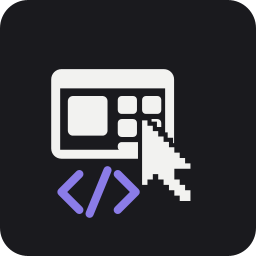

<div align="center">



# Minecraft GUI Designer

**A standalone visual designer for Minecraft screens — Java Edition and Bedrock
Edition, each with its own widget set, visual identity and export pipeline.**

Windows desktop app · Android app · one shared editor core

**[⬇ Download the latest release](https://github.com/lhetvillanueva2000-maker/GUI-developer/releases/latest)**

</div>

---

## Download

Everything is published on the
[releases page](https://github.com/lhetvillanueva2000-maker/GUI-developer/releases/latest).

| You want | Grab |
| --- | --- |
| **Windows** | `MinecraftGuiDesigner-<version>.exe` — installer, no Java needed |
| **macOS (Apple Silicon)** | `MinecraftGuiDesigner-<version>-macos-aarch64.dmg` — any Mac from 2020 on |
| **macOS (Intel)** | `MinecraftGuiDesigner-<version>-macos-x64.dmg` |
| **Android** | `androidApp-release.apk` — enable "install from unknown sources" when prompted |
| **Google Play** | `androidApp-release.aab` — an app bundle for uploading to Play, not installable on a phone |
| **Linux** | `minecraft-gui-designer_<version>-1_amd64.deb` |
| **Any OS with a JVM** | `MinecraftGuiDesigner-windows-x64-<version>.jar` — `java -jar <file>` |
| **Everything at once** | `minecraft-gui-designer-<version>.zip` — all of the above plus source, templates and docs |

The individual installers are attached to the release alongside the combined
ZIP, so there is no need to download ~360 MB just to get one of them. Each
desktop package embeds its own Java runtime, which is why they are large and
why nothing has to be installed first.

`MANIFEST.txt` inside the ZIP lists every file with its SHA-256.

**First launch on macOS.** The `.dmg` is not signed with an Apple Developer
certificate, so Gatekeeper blocks the first launch. Open it once with
**right-click → Open** and choose **Open**, or clear the quarantine flag:

```bash
xattr -dr com.apple.quarantine "/Applications/MinecraftGuiDesigner.app"
```

Every launch after the first is normal.

> Release binaries are attached to releases, never committed to the repository —
> GitHub rejects files over 100 MB in git, and a binary in history bloats every
> clone forever.

---

## What it does

Build, edit, preview and export Minecraft GUIs without opening the game.

- **Two real editors, not one with a toggle.** Java and Bedrock have different
  widget vocabularies, different layout conventions and completely different
  export formats. Each gets its own skin folder, its own palette, and its own
  drawing code.
- **Desktop and Android are different apps on the same core.** The desktop shell
  is a multi-dock, keyboard-driven design tool. The Android app is bottom sheets,
  a navigation rail and touch gestures built for a thumb. They share the document
  model, the editor logic and the exporters — nothing else.
- **Import your own textures.** Any PNG/JPG/WebP/GIF becomes a button skin, panel
  background, icon or item preview, with nine-slice insets so custom art
  stretches properly. Images live inside the project file, so a `.mcgui` is a
  single self-contained document.
- **Export to the format the game actually reads.** One **Export** button lists
  every format the design can become, with Minecraft's own at the top and marked
  as such: Bedrock **JSON UI** (drop it in a resource pack and the game draws the
  screen — no mod, no code) and the Java **`.mcmeta` + atlas definitions** that
  tell Java Edition how to scale and animate the screen's images. Below those sit
  the ones for use outside the game — a standalone HTML + CSS page with real
  `:hover` / `:active` states, a plain stylesheet, an SVG that keeps every shape
  as a real vector, a Compose `@Composable`, a Java `Screen` subclass, and the
  raw project document.
- **Draw your own shapes.** Seventeen of them — rectangles, circles, triangles,
  stars, polygons of any side count, arrows, chevrons, speech bubbles — each with
  fill or gradient, an outline, rotation and a label. They resize, restyle and
  export like any other element, and the SVG export keeps them as real polygons.
- **Animated images and GIFs.** Import a GIF and it is converted to the vertical
  frame strip both editions animate natively, complete with the `.mcmeta` timing
  sidecar. It plays in the editor at the cadence it was authored with, plays in
  the game, and plays in the exported HTML. Uneven frame delays are preserved
  frame by frame rather than flattened. For anything that is not a GIF —
  frames exported from a video, a sequence rendered elsewhere — **Build an
  animation from images** stacks the files you pick into the same strip.
  (Video files themselves are not decoded: that needs a codec the app does not
  ship. Export the frames first with any video tool and import those.)
- **Anything the catalog does not have.** A **Custom element** takes a type name
  of your choosing and any `key=value` properties you like, and every exporter
  passes them straight through.
- **Move things exactly.** Four arrows appear over the canvas whenever something
  is selected, on desktop and on the phone alike. The step is yours to set — and
  the arrow keys use the same one, so the buttons and the keyboard can never
  disagree. Optionally it walks the grid a line at a time instead.
- **Pick an edition, get that edition.** Java and Bedrock are two tabs across
  the top of both apps. Whichever is lit, everything below it belongs to that
  edition — the component palette, the templates, the skin, the validation rules
  and the export formats all follow. Switching keeps the document and reports
  anything the new edition cannot express instead of dropping it.
- **Save a group once, reuse it forever.** Select a header and its buttons, a
  row of slots, a whole settings block, and save it as a *prefab*. It drops into
  any later project as one piece, carrying the textures it uses with it.
- **A texture library that outlives the project.** Everything you import joins a
  searchable library that every future project can pull from — and you can fill
  it in one go by importing a real Minecraft resource pack (`.zip` / `.mcpack`,
  Java or Bedrock). The importer puts the GUI art first and leaves the four
  thousand block textures unticked.
- **Export everything in one pass.** One action writes both edition packs, every
  code target and the project document into a single organised tree.
- **Light or dark, and a wallpaper behind it.** The theme follows your system by
  default and can be pinned either way. The canvas never changes with it — a
  vanilla button is the same grey in a light editor as in a dark one.
- **Continuous validation.** Broken sizes, missing textures, out-of-canvas
  elements, unsupported edition-specific properties and undersized touch targets
  are flagged as you work, with a one-click jump to the offending element.
- **It does not lose your work.** Nothing replaces the open document without
  asking first — New, Open, templates, quitting and the Android back gesture all
  offer Save / Discard / Cancel. The desktop app autosaves a recovery snapshot
  on a timer while there are unsaved edits and offers it back if it was
  killed; the Android app writes the working document to internal storage
  whenever it is backgrounded, so a process kill is not a lost afternoon. How
  often it snapshots is one of the **Editor settings**, alongside the move step,
  the duplicate offset and whether to confirm a delete.
- **It remembers where you were.** Window size and position, which docks were
  open, the last export target and the recent-projects list are all restored on
  the next launch.

---

## Screens at a glance

| | Desktop | Android |
| --- | --- | --- |
| Edition switch | Tabs across the top | Tabs across the top |
| Navigation | Menu bar + five toolbox docks | Bottom nav / rail + modal sheets |
| Placement | Arm from palette, click to drop | Tap a component tile, it lands centred |
| Move | Drag any element | Drag an **already selected** element |
| Pan | Middle/right drag, wheel | One-finger drag on empty space |
| Zoom | Ctrl+wheel | Pinch |
| Multi-select | Shift+click, marquee | Long press |
| Properties | Always-visible inspector dock | Bottom sheet with chip pickers |
| Align & arrange | Toolbar row + Arrange menu | Arrange sheet |
| Nudge | Move pad on the canvas, or the arrow keys | Move pad on the canvas |
| Shapes & custom | Bottom bar + Insert menu | "Custom" in the bottom nav |
| Settings | View ▸ Editor Settings, or ⋯ in the bottom bar | ⋮ ▸ Editor settings |
| Prefabs & library | Docks beside the palette | Bottom sheets |
| Export | Folder or `.zip` | `.zip` via the Storage Access Framework |

---

## Component library

Available from the first launch, in both editions unless noted.

**Containers** — Chest background panel · Panel frame with shadows · Scroll
container
**Inventory** — Inventory slot · Hotbar strip
**Controls** — Button · Toggle button · Tab button · Icon button · Checkbox ·
Dropdown · Slider · Java-style rectangular button *(Java only)*
**Text & input** — Label · Text box · Search field
**Feedback** — Progress bar · Tooltip box
**Decoration** — Header bar · Decorative separator · Image / texture slot ·
Animated image / GIF
**Touch controls** — Touchpad button *(Bedrock only)* · Mobile action button
*(Bedrock only)*
**Shapes** — Rectangle · Rounded rectangle · Ellipse / circle · Triangle · Right
triangle · Diamond · Pentagon · Hexagon · Octagon · Star · Cross · Chevron ·
Arrow · Speech bubble · Parallelogram · Trapezoid · Regular polygon
**Custom** — Custom element · Custom container

Press `F1` (or **Components** in the header) to browse all of them at once, each
with a live preview, its default size, whether it resizes, how many states it
supports and which editions it exists in.

Every interactive component supports **normal / hover / pressed / focused /
disabled** states, stored as overrides so only what you actually changed is
saved. Bedrock drops hover and focus — touch has no pointer.

The **Shapes** and **Custom** rows are reached from the bottom bar's
**＋ Add anything** button (desktop) or the **Custom** tab in the bottom
navigation (Android), rather than from the component palette: a hexagon is a
drawing primitive, not a Minecraft widget, and filing it beside "Chest
background panel" would misrepresent both.

---

## Templates

Seven ready-to-use layouts ship with the app and are regenerated from code on
every build, so they can never drift out of sync with the component catalog.

| Template | Edition | Canvas |
| --- | --- | --- |
| Java Chest Container | Java | 176 × 166 |
| Java Options Menu | Java | 256 × 200 |
| Java Machine UI | Java | 176 × 182 |
| Bedrock Touch HUD | Bedrock | 320 × 180 |
| Bedrock Settings Sheet | Bedrock | 320 × 180 |
| Bedrock Pocket Container | Bedrock | 320 × 180 |
| Bedrock Action Form | Bedrock | 320 × 180 |

The `.mcgui` sources are in [`templates/`](templates), and a full worked example
of every export format is in
[`templates/sample-output/`](templates/sample-output).

---

## Getting started

### Requirements

- **JDK 17** — the Gradle build will download one automatically if you have a
  different version installed.
- **Android SDK** (API 35) — only needed for the Android app. Without it the
  build automatically drops `:androidApp` and every `androidTarget()` so the
  desktop side still builds; pass `-PskipAndroid=true` to force that.

### Run it

```bash
git clone https://github.com/lhetvillanueva2000-maker/gui-developer.git
cd gui-developer

./gradlew :desktopApp:run          # desktop editor
./gradlew :androidApp:installDebug # Android app on a connected device
```

### Build the artifacts

```bash
# Windows .exe + .msi  (must be run on Windows)
./gradlew :desktopApp:packageReleaseExe :desktopApp:packageReleaseMsi

# Native package for whatever OS you are on (.deb / .dmg / .exe)
./gradlew :desktopApp:packageDistributionForCurrentOS

# Portable jar that runs anywhere with a JVM
./gradlew :desktopApp:packageUberJarForCurrentOS

# Android APK (sideload) and .aab (Google Play upload)
./gradlew :androidApp:assembleRelease :androidApp:bundleRelease
```

### Package a full release ZIP

```bash
./build-scripts/package-release.sh 1.0.0        # Linux / macOS
.\build-scripts\package-release.ps1 -Version 1.0.0   # Windows
```

Produces `dist/minecraft-gui-designer-<version>.zip` containing the desktop
installer, the APK, the templates, the docs and a source archive, plus a
`MANIFEST.txt` listing every file.

Because a Windows `.exe` can only be produced on Windows and a macOS `.dmg`
only on macOS, [`.github/workflows/release.yml`](.github/workflows/release.yml)
builds each platform on its own runner - Windows, macOS on both Apple Silicon
and Intel, and Linux (which also builds Android) - and merges them with
[`build-scripts/bundle-release.sh`](build-scripts/bundle-release.sh) into a
single ZIP, attached to the GitHub Release. Push a `v*` tag to trigger it:

```bash
git tag v1.0.0 && git push origin v1.0.0
```

Binaries are not committed to the repository — they are release artifacts.

---

## Other tasks

```bash
./gradlew testAll            # every unit test: core, exporters and desktop shell
./gradlew validateProjects   # regenerate + validate every bundled template
./gradlew generateIcons      # re-render the app icon for every platform
./gradlew generateBackdrops  # re-render the editor wallpaper
./gradlew assembleAll        # everything this host can produce
```

---

## Repository layout

```
sharedCore/     Document model, element catalog, editor state, undo/redo,
                snapping, validation, serialization, templates. No UI.
styles/         Compose rendering and theming
  java/           Java Edition palette + skin  (independent)
  bedrock/        Bedrock Edition palette + skin  (independent)
exporters/      Java resource pack, Bedrock JSON UI, code generators
desktopApp/     Compose Desktop shell: menus, docks, mouse, AWT dialogs
androidApp/     Compose Android shell: sheets, nav, touch, SAF
assets/icon/    App icon, generated from build-scripts/icon
assets/backdrop/ Editor wallpaper, generated from build-scripts/backdrop
templates/      Bundled .mcgui templates + sample export output (generated)
docs/           Architecture, project format, exporting, editor guide
build-scripts/  Packaging scripts and the icon renderer
.github/        CI and release workflows
```

---

## Documentation

| Document | What it covers |
| --- | --- |
| [Architecture](docs/architecture.md) | Module split, document model, undo strategy, rendering |
| [Project format](docs/project-format.md) | The `.mcgui` JSON format, field by field |
| [Exporting](docs/exporting.md) | Java pack, Bedrock pack, code generation, parity warnings |
| [Editor guide](docs/editor-guide.md) | Desktop and Android interaction models, shortcuts, validation |
| [Extending](docs/extending.md) | Adding components, templates, themes and code targets |

---

## Tech

Kotlin Multiplatform · Compose Multiplatform · Gradle · kotlinx.serialization

---

## Licence

MIT — see [LICENSE](LICENSE).

Not affiliated with Mojang or Microsoft. Minecraft is a trademark of Mojang AB.
